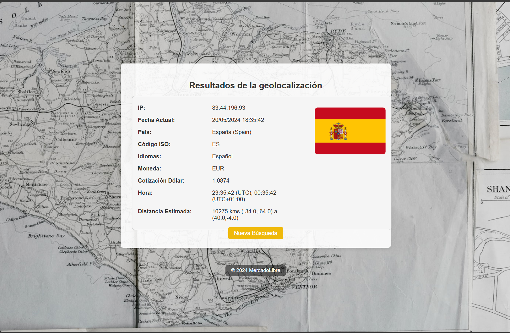

<div align="center">
    <h1 style="font-family: 'Arial', sans-serif; color: #FF9900;">Servicio Geolocalización por IP</h1>
    <p>
        <a href="#"></a>
        <a href="#"></a>
        <a href="#"></a>
        <a href="#"></a>
        <a href="#"></a>
        <a href="#"></a>
        <a href="#"></a>
        <a href="#"></a>
        <a href="#"></a>
    </p>
</div>

---

Microservicio de geolocalización expuesto mediante una petición GET. Al llamarse el endpoint, este realiza peticiones asíncronas a las API públicas necesarias para obtener información asociada a una IP. El servicio responde con un objeto que indica el resultado de todas las peticiones ejecutadas junto con un código y descripción de respuesta.

### Características

- **Java 21**: Utiliza la última versión de Java para un rendimiento y seguridad óptimos.
- **Spring Boot 3.2.5**: Framework robusto para el desarrollo de aplicaciones Java.
- **WebFlux**: Soporte para programación reactiva.
- **MongoDB**: Base de datos NoSQL para almacenamiento de datos.
- **Caffeine Cache**: Mecanismo de caché de alto rendimiento.
- **Thymeleaf**: Motor de plantillas para generar vistas HTML.
- **Swagger**: Documentación interactiva de la API.

### Endpoints

#### Obtener información de geolocalización por IP
```http
GET /mercadolibre/geolocation/ip?ip={ip}
```

- **Parámetros**:
    - `ip` (string): Dirección IP para la cual se desea obtener información.

- **Respuesta exitosa (200)**:
  ```json
  {
    "status": {
      "statusCode": "200",
      "statusDescription": "Solicitud procesada correctamente"
    },
    "data": {
      "ip": "8.8.8.8",
      "fechaActual": "2024-05-16T10:00:00Z",
      "pais": "Estados Unidos",
      "isoCode": "US",
      "idiomas": {
        "en": "English"
      },
      "moneda": {
        "codigo": "USD",
        "cotizacionDolar": "1.00"
      },
      "hora": [
        {
          "valor": "2024-05-16T10:00:00Z",
          "zonaHoraria": "UTC-5"
        }
      ],
      "distanciaEstimada": "1000 km",
      "bandera": "https://flagcdn.com/us.svg"
    }
  }
  ```

- **Errores**:
    - **400 Bad Request**: IP inválida.
    - **500 Internal Server Error**: Error procesando la solicitud.

#### Obtener estadísticas de geolocalización
```http
GET /mercadolibre/geolocation/ip/statistics
```

- **Respuesta exitosa (200)**:
  ```json
  {
    "statusResponse": {
      "statusCode": "200",
      "statusDescription": "Solicitud procesada correctamente"
    },
    "distanciaMaxima": 10000,
    "distanciaMinima": 100,
    "distanciaPromedio": "5000.5",
    "paisDistanciaMaxima": "Estados Unidos",
    "paisDistanciaMinima": "México"
  }
  ```

#### Páginas de frontend
```http
GET http://localhost:8090/mercadolibre/geolocation/ip/home
```
- Devuelve la página de inicio.
<p>
    
</p>

```http
GET http://localhost:8090/mercadolibre/geolocation/ip/results?ip={ip}
```
- Muestra los resultados de la consulta de geolocalización para la IP proporcionada.
<p>

</p>


### APIs Públicas Consumidas

Este servicio consume las siguientes APIs públicas:

- **[Rest Countries](https://restcountries.com)**: Para obtener información de los países.
- **[IP-API](http://ip-api.com)**: Para obtener información de geolocalización basada en IP.
- **[ExchangeRate-API](https://www.exchangerate-api.com)**: Para obtener tasas de cambio de moneda.

### Instalación y Ejecución

#### Prerrequisitos
- Apache Maven 3.9.6 o superior
- JDK 21
- Docker

#### Construcción del Proyecto

1. Clonar el repositorio:
   ```bash
   git clone https://github.com/tu_usuario/bac-ml-ms-geolocation-ip-java.git
   cd bac-ml-ms-geolocation-ip-java
   ```

2. Construir el proyecto con Maven:
   ```bash
   mvn clean install
   ```

#### Ejecución con Docker Compose

1. Crear y ejecutar los contenedores:
   ```bash
   docker-compose up --build
   ```

2. Detener y eliminar los contenedores:
   ```bash
   docker-compose down
   ```
### Explicación del Dockerfile

El `Dockerfile` define cómo se construye la imagen de Docker para el microservicio. A continuación se muestra una breve explicación de las instrucciones relevantes a ejecutar:

```dockerfile
FROM eclipse-temurin:21-jdk
WORKDIR /opt/java
COPY target/bac-ml-ms-geolocation-ip-java-1.0-SNAPSHOT.jar /opt/java/app.jar
CMD ["java", "-jar", "app.jar"]
```

- **FROM eclipse-temurin:21-jdk**: Usa la imagen base de OpenJDK 21.
- **WORKDIR /opt/java**: Establece el directorio de trabajo.
- **COPY target/bac-ml-ms-geolocation-ip-java-1.0-SNAPSHOT.jar /opt/java/app.jar**: Copia el archivo JAR generado por Maven a la imagen de Docker.
- **CMD ["java", "-jar", "app.jar"]**: Especifica el comando para ejecutar la aplicación cuando se inicie el contenedor.

### Explicación del docker-compose.yml

El archivo `docker-compose.yml` define y configura las dependencias necesarias para ejecutar el servicio. A continuación se muestra una breve explicación de las secciones más importantes:

```yaml
version: '3.8'
services:
  app:
    build: .
    ports:
      - "8090:8090"
    environment:
      SPRING_DATA_MONGODB_URI: mongodb://mongo:27017/geolocation
    depends_on:
      - mongo

  mongo:
    image: mongo:latest
    container_name: geolocation-mongo
    ports:
      - "27017:27017"
    volumes:
      - mongo-data:/data/db

volumes:
  mongo-data:
```

- **services**: Define los servicios que se van a ejecutar.
    - **app**: El servicio de la aplicación.
        - **build**: Construye la imagen de Docker usando el `Dockerfile` en el directorio actual.
        - **ports**: Mapea el puerto 8090 del contenedor al puerto 8090 del host.
        - **environment**: Define las variables de entorno necesarias.
        - **depends_on**: Especifica que el servicio `app` depende del servicio `mongo`.
    - **mongo**: El servicio de MongoDB.
        - **image**: Usa la imagen oficial de MongoDB.
        - **ports**: Mapea el puerto 27017 del contenedor al puerto 27017 del host.
        - **volumes**: Define un volumen para persistir los datos de MongoDB.
- **volumes**: Define los volúmenes que se utilizan para persistir datos entre reinicios de contenedores.

### Documentación de la API

Accede a la documentación de la API generada con Swagger en la siguiente URL una vez el servicio esté en ejecución:
```
http://localhost:8090/mercadolibre/geolocation/ip/webjars/swagger-ui/index.html/
```
### Colección de Postman

Puedes descargar la colección de Postman desde el siguiente enlace:

[Descargar colección de Postman](src/main/resources/postman/geolocation-ip-service.postman_collection.json)